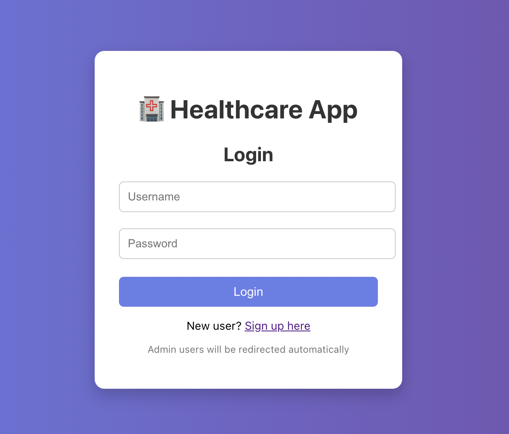
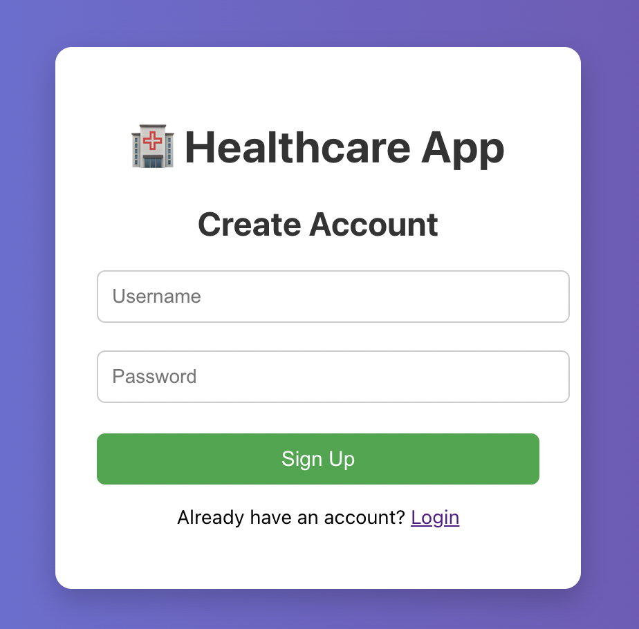
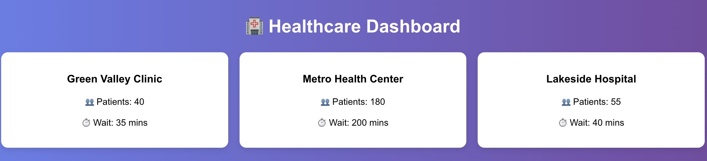
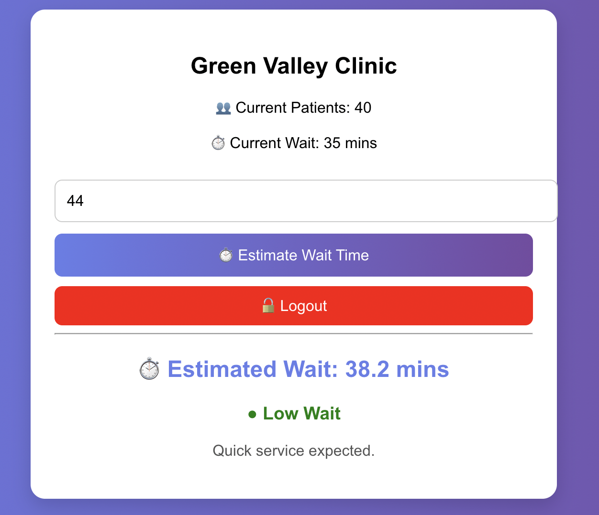
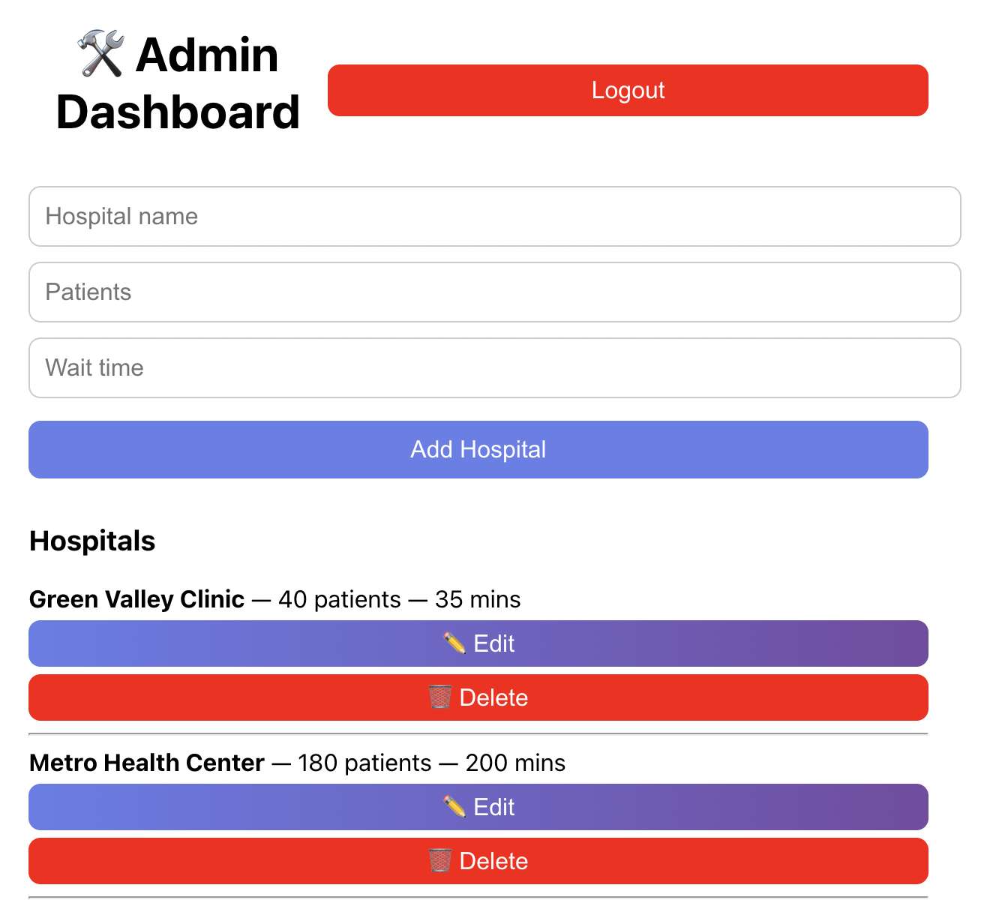

# 🏥 Healthcare Waiting Time Prediction Platform

A full-stack healthcare web application that predicts hospital waiting times using Machine Learning.

Built using React, Django REST Framework, and Scikit-learn.

---

# 🚀 Features

## 👤 User Features

- User Signup & Login
- Token-based Authentication
- Hospital Dashboard
- AI Wait Time Prediction
- Wait Level Detection
- Logout Functionality

---

## 🛠 Admin Features

- Admin Dashboard
- Add Hospitals
- Edit Hospitals
- Delete Hospitals
- Protected Admin APIs

---

# 🤖 Machine Learning

The system uses a trained RandomForestRegressor model to estimate hospital waiting times based on:

- Incoming patients
- Current patients
- Current waiting time

---

# 🔐 Security

- Token Authentication
- Protected API Routes
- Admin-only Access
- Username Validation
- Password Validation

---

# 🧰 Technologies Used

## Frontend
- React.js
- JavaScript
- CSS

## Backend
- Django
- Django REST Framework
- SQLite

## Machine Learning
- Scikit-learn
- Pandas
- Joblib

---

# ⚙️ Installation

## Backend

```bash
cd backend
python -m venv venv
source venv/bin/activate
pip install -r requirements.txt
python manage.py runserver
```

## Frontend

```bash
cd frontend
npm install
npm start
```

---

# 📸 Application Screenshots

## 🔐 Login Page



---

## 📝 Signup Page



---

## 🏥 User Dashboard



---

## 🤖 Wait Time Prediction



---

## 🛠 Admin Dashboard


